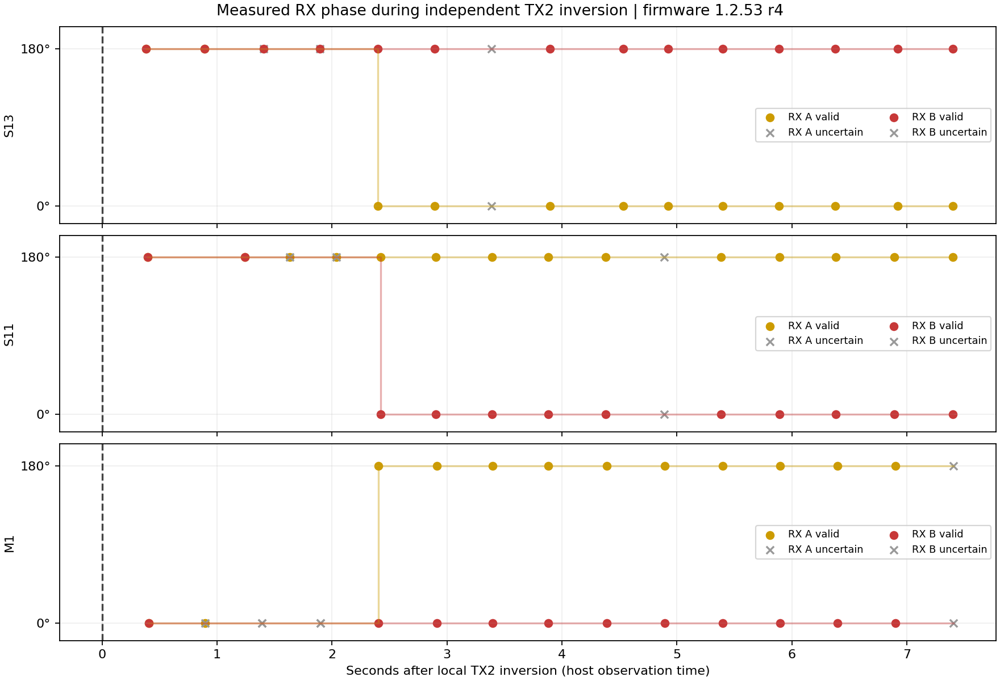

# Детектор приёмной фазы 1.2.53: реализация и испытания

Дата: 2026-09-29. Кандидат: **1.2.53 r5**.

На **M1, S11, S12 и S13** записан одинаковый образ. Проверка приёмной фазы
выполняется на **M1, S11 и S13**. S12 исключён из приёмки качества детектора
по указанию пользователя; синхронизация, ADC и USB контролируются на всех четырёх.
Изменение аналогового усиления S13 является отдельной последующей задачей.

**Проверка завершена.** Пользователь сократил требование с 30 до 20 минут.
Накопленные счётчики охватывают **1468,865–1469,004 с (24 мин 29 с)**.
Регулярный опрос выполнялся 19 мин 30–35 с, затем сборщик остановился из-за
двух несовместимых SWD-снимков во время публикации. Финальное чтение сделано
без сброса плат и счётчиков через 294–299 с. Это пропуск наблюдений сборщика,
а не измеренный простой плат; непрерывная достоверность RX в пропуске не проверена.
Полный 30-минутный тест не заявляется.

## Итог длительного наблюдения r5

| Плата | Максимальная ошибка RS485, мкс | ADC, кадров/с | Достоверные RX A/B | Смены RX-фазы |
|---|---:|---:|---|---:|
| S13 | 2,891 | 400,290 | 236/236 каждый | 0 |
| S11 | 2,644 | 400,291 | 237/237 каждый | 0 |
| S12 | 2,698 | 400,291 | вне приёмки RX | 0 |
| M1 | master, опорная плата | 400,291 | 237/237 каждый | 0 |

На всех четырёх за весь интервал счётчиков: unlocked, phase flip/restart,
ADC faults, разрывы ADC >10 мс и USB recovery — **0**. Скорость USB completions:
S13 346,574/с, S11 304,393/с, S12 357,715/с, M1 301,845/с; это не счётчик
полноты доставки ADC на хост. Накопленные аппаратные максимумы фазы покрывают
пропуск опроса. Поток ADC, USB и TX при финальном чтении активны; TX1/TX2 = 0°.
Flash всех четырёх повторно прочитана и побайтово совпала с образом r5.

Машинный отчёт: [stability_summary.json](rx_phase_implementation_20260929/stability_summary.json).

## Реализация

- A/B оцениваются независимо по реальным отсчётам ADC, без чтения заданной TX-фазы.
- Выделяется звенение 6,25 кГц в трёх окнах. Постоянная и линейная составляющие
  подавляются; комплексные векторы нормируются по амплитуде.
- Чётные и нечётные кадры приводятся к полярности чётных; обе чётности имеют
  одинаковый вес. Накапливаются три блока по 500 мс.
- Проверяется достаточность кадров, амплитуда, согласованность фаз между
  кадрами и окнами, удалённость от границы решения 90° и доля ограничения.
- Результат — 0°/180° и отдельный `valid`. При недостатке данных последняя
  бинарная фаза сохраняется, но не объявляется достоверной.
- Первый экстремум и первый отсчёт рабочей зоны для принятия решения не используются.

Фиксированная ось 110° выбрана по исследованным сигналам и не переобучается
после запуска. Это кандидат для бинарной классификации звенения, **не метрологическая
оценка абсолютной фазы катушки**. Изменение частоты звенения или аналогового
тракта требует новой проверки. При сумме передатчиков детектор характеризует
принятый сигнал и не определяет, какому TX принадлежит каждая его составляющая.

Результат относится к `buffer_index` чётных кадров. Восстановление общей
синхронизации после перезапуска master может изменить соответствие чётности
физической полярности маркера. Поэтому разные значения до и после прошивки
master нельзя автоматически объявлять ошибкой или заново назначать нулём.

## Защита основного потока

Расчёт вызывается в конце основного цикла. Он не выполняется в ADC/DMA IRQ,
не запрещает прерывания, не ожидает USB и не изменяет таймеры или TX.
Примерно 40 раз/с копируется завершённая пара ADC в собственную память DTCM;
проверяются поколение и владение DMA до/после копирования. Читатель не потребляет
FIFO, не удерживает DMA-слот и не использует повторно старые sequence.
Расчёт разбит на порции до 24 отсчётов. Кэш ответа публикуется раз в 500 мс.

На S13 выполнено сравнение четырёх последовательных интервалов примерно по
31 секунде на r4: выключен → включён → включён → выключен. В r5 вычислитель
не изменён; изменена только проверка свежести при публикации.

| Детектор | ADC, кадров/с | USB completions/с | Измеряемая фоновая работа CPU |
|---|---:|---:|---:|
| выключен | 400,290 | 347,742 | 0% |
| включён | 400,293 | 350,870 | 1,242% |
| включён | 400,291 | 348,867 | 1,237% |
| выключен | 400,291 | 349,847 | 0% |

Частота CPU прочитана: 550 МГц. DWT-оценка включает прерывания внутри измеряемых
порций, но не каждый быстрый выход из функции. Это оценка нагрузки.
Снижение скорости ADC/USB в данном сравнении не обнаружено. Приращения
ADC faults, разрывов ADC >10 мс, USB recovery, phase flip/restart и unlocked = 0.
USB completions не равны числу переданных ADC-пар и включают служебные ответы.

## Переключения на трёх платах

На r4 на каждой плате по отдельности инвертировались TX1 и TX2 на 7 секунд, затем
возвращались исходные настройки. Все запросы и фактически применённые фазы
прочитаны обратно. После серии TX-маска на всех трёх — 0, поток и TX включены.

В этой конфигурации получены следующие изменения локального RX:

| Переключение | RX A | RX B | Первое наблюдение подтверждённого переворота |
|---|---|---|---:|
| S13 TX1 | без смены класса | без смены класса | — |
| S13 TX2 | 180° → 0° → 180° | класс 180° сохранён | около 2,40 с |
| S11 TX1 | без смены класса | без смены класса | — |
| S11 TX2 | класс 180° сохранён | 180° → 0° → 180° | около 2,42 с |
| M1 TX1 | без смены класса | без смены класса | — |
| M1 TX2 | 0° → 180° → 0° | класс 0° сохранён | около 2,40 с |

Время включает дискретность опроса около 0,5 с. Во время перехода результат
может временно стать недостоверным. На r4 встречались отдельные `valid=0`
при стабильном угле из-за слишком короткого порога свежести 250 мс: фон
иногда уступал основным задачам примерно на 290 мс. В **r5 порог равен периоду
публикации, 500 мс**. После исправления минутная проверка на M1/S11/S13 дала
61/61 достоверных снимков каждого из шести каналов. Проверки согласованности,
амплитуды и числа кадров не ослаблялись. UI всё равно должен явно показывать
состояние `valid`, а не выдавать сохранённое число за новое измерение.

Во всей серии на трёх платах: новых срывов синхронизации, phase flip/restart,
ADC faults, разрывов ADC >10 мс и USB recovery — **0**. Аппаратный переворот
катушек в этой серии не выполнялся. Физическое переключение не проверило обе
полярности каждого из шести RX: часть каналов в данной установке не меняет
бинарный класс при переключении собственного TX.

## Программные и USB-проверки

- C-код собран и выполнен нативным GCC на Raspberry Pi: противоположные фазы
  каналов, изменение амплитуды и DC, неполные углы, смена фазы, короткий выброс,
  90°, слабый сигнал, чрезмерное ограничение, неверная чётность, запуск с уже
  инвертированным сигналом и сброс истории после паузы. Все проверки пройдены.
- Четыре Python-теста проверили декодер, torn/короткий ответ, переполнение
  миллисекундного счётчика и параметры команды только чтения.
- Через действующие Raspberry Pi `.163`, `.132`, `.173` получено по 30 ответов
  `GET_RX_PHASE` без остановки запущенных хостов. Также проверены ответы
  `GET_TX_PHASE` (TXP1) и `GET_RELAY_STATUS` (RLY1).

## Веб-переключатели TX1/TX2

На окончательной r5 через Chrome открыты действующие страницы S13 `.163`,
S11 `.132` и M1 `.173`, раздел **Operating Mode → TX phase**. На каждой
выполнена последовательность:

`0/0 → 180/0 → 180/180 → 0/180 → 0/0`.

После каждого изменения прочитано фактическое состояние STM32 через USB
TXP1 либо независимо через SWD. Маски requested/applied последовательно
равнялись `0 → 1 → 3 → 2 → 0`. Переключение TX1 сохраняет фазу TX2, и наоборот.
На S13 дополнительно проверены физические уровни PA1/PA2 относительно PC7
в ответе TXP1 для масок 1 и 3. Это чтение GPIO, не внешнее осциллографическое
измерение выводов.

Все три веб-страницы в конце показали **TX1=0°, TX2=0°, Applied · saved**.
TX и поток остались включены. Привязка каналов исправления не потребовала;
код веб-портала и программы хоста не изменялся. На r5 также наблюдались
ожидаемые изменения RX: S13/A, S11/B и M1/A при переключении соответствующего TX2.

## Передача хосту

Команда **EP0 IN 0x4E**, ответ **RXP1, 112 байт**. Отдельные `phase/valid/quality`
для A и B; диагностические данные о раннем ограничении и фиксированной рабочей
зоне `[300:500)`. Опрос 1 Гц из очереди диагностики низкого приоритета.

Полная инструкция: [RX_PHASE_HOST_INTEGRATION_RU.md](RX_PHASE_HOST_INTEGRATION_RU.md).
Готовый декодер: [vendor_rx_phase.py](vendor_rx_phase.py).

## Образ и доказательства

Образ всех четырёх плат проверен чтением Flash и побайтовым сравнением:
SHA-256 `2a75876628c0b4a29bc5214933905eabb023af3bd4a1ec7cead46320e4e907fc`.
Исходный стабильный образ 1.2.52 r10 сохранён для отката.

Сырые данные находятся в `.tmp/rx-phase-implementation-20260929/`:

- `candidate-1.2.53-r5.elf`, `.bin`, `.map` — неизменяемый кандидат;
- `deploy-r5/` — образы до/после прошивки и журналы верификации;
- `profile-r4/` — сравнение включённого/выключенного детектора;
- `switch-three-r4/results.json` — полная серия переключений и восстановление;
- `ep0-192.168.0.*.jsonl` — ответы USB через Raspberry Pi;
- `r5-freshness-60s/` — проверка исправленного порога свежести;
- `web-switch-r5/` — проверка веб-переключателей с чтением STM32;
- `stability-30min-r4/` — прерванное раннее наблюдение, не 30-минутная приёмка;
- `stability-30min-r5/` — регулярная часть наблюдения окончательного образа;
- `stability-final-r5/summary.json` — итог с сокращённым требованием и описанием пропуска;
- `final-verification-r5/` — финальные счётчики, состояния TX и побайтовая проверка Flash.
