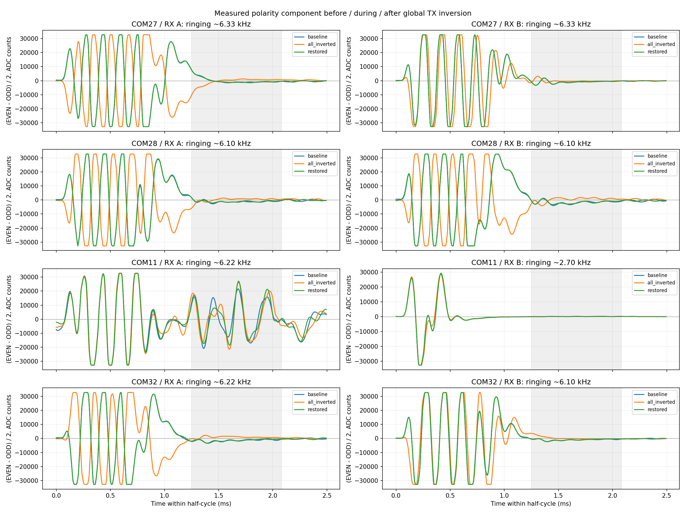
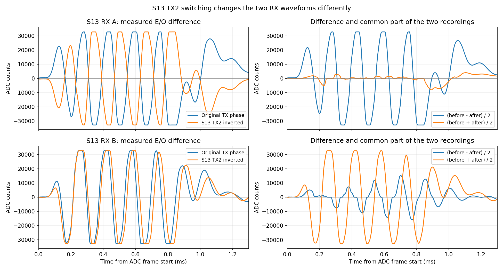
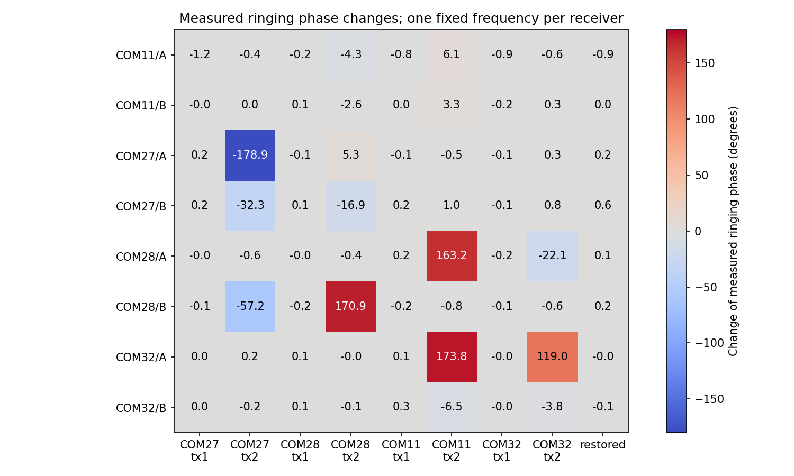

# Измерение фазы приёмного сигнала: эксперимент на четырёх платах

Дата: 2026-09-29. Прошивка во время эксперимента: **1.2.52, r10**.

## Вывод после проверки на осциллографе

**Первый экстремум исключён из рекомендуемых критериев.** После отдельного
переключения S13 пользователь подтвердил, что переключение видно, и сообщил,
что первый экстремум не подходит для определения фазы. Накопление уменьшает
шум, но не исправляет неверно выбранный признак.

Следующий кандидат — оценка фазы **нескольких периодов реально принятого
звенения**, отдельно для RX A и RX B, с накоплением комплексных составляющих
за 1–2 секунды. Амплитудный эталон для этого не нужен. Проверять следует
согласованность оценки на разных участках сигнала и между кадрами.

Этот документ описывает исследовательский этап на 1.2.52. Продолжение —
[реализация и испытания детектора 1.2.53](RX_PHASE_1.2.53_RU.md),
[инструкция разработчику хоста](RX_PHASE_HOST_INTEGRATION_RU.md).
Аппаратный переворот катушки отдельно ещё не проверен.

## Что сделано на устройствах

| Узел | COM | ST-LINK | Роль |
|---|---|---|---|
| S13 | COM27 | 0670FF535548877187163910 | Slave |
| S11 | COM28 | 066DFF514953667287234159 | Slave |
| S12 | COM11 | 066FFF565556857187224249 | Slave |
| M1 | COM32 | 066EFF514953667287242707 | Master |

Перед измерениями прочитан и проверен весь используемый образ Flash каждой
платы: 315604 байта, SHA-256
`2fc61eb5e51a97e60f1c7eacc2ee96e927e6e555c556d3731bbac1512c03e6b9`.

Выполнены две законченные серии:

1. Исходное состояние → инверсия обоих TX на всех четырёх платах → возврат.
2. Исходное состояние → восемь состояний с инверсией одного TX на одной плате
   при исходных фазах остальных выходов → возврат.

В каждой точке записывались оба ADC на всех четырёх платах. Приняты
**1324 согласованных снимка кадров**, каждый содержит A и B одной чётности.
Это не 1324 соседние пары EVEN/ODD: чётные и нечётные снимки накапливались
раздельно. Состояния удерживались примерно 25–34 секунды; чтение четырёх
ST-LINK шло параллельно.

Затем по просьбе пользователя оба TX на **S13** переключены отдельно и
оставлены в инвертированном состоянии до его ответа. Плата прочитана обратно:
`requested=3, applied=3, tx_enabled=1, streaming=1`. Пользователь подтвердил:
«Да, вижу переключение». После ответа возвращено исходное состояние
`requested=0, applied=0`; оно также прочитано и проверено.

**В конце всех четырёх плат исходные фазы восстановлены.** Прошивка, TX enable,
режимы ADC, настройки USB и хостов в этом исследовании не менялись.

### Как получены исходные отсчёты

[capture_rx_phase_swd.py](capture_rx_phase_swd.py) читает сохранённые сырые
кадры DMA-кольца через SWD HotPlug, без остановки CPU и сброса. Проверяются
поколение захвата, счётчики до/после чтения, запас до повторного использования
слота DMA и метка чётности. Снимки, которые могли пересечь перезапись слота,
исключаются. Проверяется также применённая фаза до/после каждого снимка.

Для фазового переключения записывался только существующий байт запроса
`s_tx_phase_requested_mask`; обычный обработчик применял его на штатной
границе. Прямых изменений GPIO, таймеров или ADC не было. Скрипт привязан
к точному образу r10 и не предназначен для других прошивок/составов стенда.

В раннем пробном запуске `global_run1` обнаружено, что CubeCLI 2.20 для
`-w8` с голым десятичным аргументом не записал требуемую инверсию. Это выявила
проверка чтением; такой запуск не использован как эксперимент переключения.
В законченных сериях использованы значения `0x1`, `0x2`, `0x3`, с проверкой
применённого состояния. Отдельная визуальная проверка S13 выполнена позже.

## Что видно в сигнале

Сохранялись все 600 отсчётов полупериода. При наблюдаемой частоте кадров
около 400,29 Гц шаг отсчёта составляет примерно 4,16 мкс. Рабочая зона
по умолчанию начинается с отсчёта 300, тогда как заметное раннее звенение
находится до неё. Оценивать его по одной рабочей зоне нельзя.

У семи из восьми каналов выбранная спектральная составляющая раннего
звенения лежит примерно в **6,1–6,4 кГц**. S12/B имеет другую форму короткого
переходного процесса; выбранный максимум около 2,54 кГц. Это не доказательство
собственной частоты катушки. **200 Гц — частота повторения, а не частота
наблюдаемого быстрого звенения.**

На значительной части раннего сигнала есть ограничение ADC по 0/65535.
В окне анализа доля ограниченных отсчётов достигает примерно 20–28% у
нескольких каналов. Поэтому полученные углы — характеристика записанного
сигнала выбранным методом, не прецизионное измерение линейного аналогового тракта.



На графике показано `D=(mean(EVEN)-mean(ODD))/2`; чётности имеют равный вес,
даже если количество сохранённых кадров различается. Это выделение
чередующейся составляющей, а не предположение, что исходные E/O точно
противоположны. Их отдельные фазовые оценки также проверяются.

### Переключение S13 показывает, почему одного признака недостаточно

При инверсии TX2 на S13:

| Приёмный канал | Изменение оценки фазы звенения |
|---|---:|
| S13 / RX A | −178,9° |
| S13 / RX B | −32,3° |

Первый канал показывает почти полный переворот. Второй меняет форму и фазу
существенно иначе. Команда TX не может служить измерением фазы каждого RX.



Разности и суммы справа — точное алгебраическое разложение двух записей.
В присутствии ограничения ADC их нельзя считать доказанным выделением
отдельной физической катушки. Они показывают, что часть формы меняется,
а значительная часть может сохраняться. Причина неизменной составляющей
по этим данным однозначно не установлена.

### Результаты по остальным платам

При общей инверсии всех TX изменения оценки составили:

| Узел | RX A | RX B |
|---|---:|---:|
| S13 | +175,8° | −46,3° |
| S11 | +173,7° | +177,7° |
| S12 | +2,5° | +2,2° |
| M1 | +170,1° | −9,4° |

После возврата к исходным настройкам оценка каждого канала вернулась в
пределах **0,9°** от исходной в этой серии. Это повторяемость данной записи,
не абсолютная точность метода и не результат длительного испытания.



Отдельные переключения выявили влияние соседних передатчиков: например,
инверсия TX2 на S12 изменила оценку RX A на S11 примерно на 163° и RX A на
M1 примерно на 174°. Инверсии TX1 в этой конфигурации не дали сопоставимых
изменений принятой формы. Это наблюдения текущего стенда, а не диагноз
аппаратуры или универсальная привязка передатчиков к приёмникам.

## Предлагаемый способ измерения

1. Брать небольшую долю уже завершённых **сырых** кадров до ROI и адаптивной
   посэмпловой DC-коррекции. Вести раздельную статистику A/B и EVEN/ODD.
2. Выделять участок из нескольких периодов звенения. В исследовательском
   расчёте использованы отсчёты `[20,240)`, удаление постоянного/линейного фона
   и плавное окно. Эти границы ещё требуют проверки при другой геометрии
   катушек и режимах измерения.
3. На частоте наблюдаемого звенения вычислять две проекции — на синус и
   косинус. Их пара задаёт фазовый вектор; угол получается через `atan2`.
   Умножение всей формы на положительный коэффициент меняет длину вектора,
   но не угол. Амплитудный эталон не используется.
4. Накапливать векторы за 1–2 секунды с проверкой разброса, а не усреднять
   углы напрямую через границу −180°/+180°. Повторить оценку на нескольких
   участках звенения. Частоту обновлять медленно; при смене частотной опоры
   нельзя смешивать старые и новые накопления.
5. Если участок содержит несколько несогласованных составляющих, сигнал
   слабый, перегружен или угол сильно зависит от выбранного участка,
   выдавать качество/неопределённость. Стабильная смесь сама по себе может
   иметь устойчивый угол: одним накоплением нельзя установить источник.
6. При обнаружении изменения начинать свежее окно подтверждения. Хост
   показывает «измеряется», затем новую оценку; старое значение должно
   иметь возраст и не выдаваться за актуальное при исчезновении сигнала.

Сначала имеет смысл выводить **измеренный угол и качество**, отдельно для
обоих приёмников. Подпись «0°/180°» допустима только после определения,
какая фазовая ось считается нормальной. Значение команды TX таким эталоном
приёма не является. Произвольное присвоение текущему сигналу «0°» при каждом
включении скроет аппаратный переворот, поэтому так делать нельзя.

Текущий офлайн-угол отсчитывается от начала ADC-кадра, на фиксированной
для сравниваемых состояний частоте. Для отображения угла относительно
физического фронта TX нужно учесть временную привязку ADC к этому фронту.
Это фазовая/временная опора, не эталон амплитуды.

При локальном TX=0 можно измерять принятый внешний сигнал относительно
внутреннего SYNC, если он достаточно сильный и синхронный. Нельзя называть
это фазой выключенного передатчика. Режим TX=0 в этой серии не проверялся.

### Как сохранить приоритет ADC, обработки и USB

Расчёт должен выполняться в фоне, на небольшой собственной копии данных,
с разрешёнными прерываниями. Копия не должна удерживать DMA-слот или блокировать
основного потребителя. Если данные уже недоступны или фон занят, пропускается
диагностический снимок. Нужно проверять поколение/владение кадром до и после
копирования, как в существующем безопасном чтении ADC.

Предварительная частота отбора — например, 20 пар EVEN/ODD в секунду,
с явным балансом чётностей. Для двух каналов и 220 отсчётов это около
35 тысяч умножений с накоплением в секунду для двух проекций. Таблицы
коэффициентов готовятся заранее; FFT, `sin/cos` и поиск частоты не должны
попадать в DMA IRQ. Фоновая работа разбивается на короткие порции с бюджетом.
Это оценка объёма вычислений, не замер загрузки STM32.

Хосту достаточно отдельного небольшого статуса RX: угол/полярность,
частота опоры, качество, возраст, признак неопределённости. Формат текущего
потока ADC и команды TX менять для этого не требуется. Если хост получает
только ROI, ранний участок ему недоступен: тогда оценка делается в STM32,
а не за счёт увеличения основного USB-потока.

## Проверки и ограничения

Во всех законченных сериях, включая промежутки переключения, прирост
`adc_fault_count`, `adc_gap_over10ms`, `usb_recovery`, `phase_flip`,
`phase_restart`, `unlocked_count` равен нулю. ADC публиковал примерно
400,24–400,39 кадра/с. Накопленные пики рассогласования RS485 у slave —
2,76–2,92 мкс. Они не выросли между началом и концом серий.

Завершения USB продолжались, наблюдалось примерно 338,75–359,45/с.
Этот счётчик не доказывает доставку всех ADC-кадров хосту. Нового расчёта
на STM32 ещё нет, поэтому отсутствие его влияния на производительность
предстоит измерить после реализации и повторить длительное испытание.

[analyze_rx_phase_ringing.py](analyze_rx_phase_ringing.py) воспроизводит
исследовательские оценки. На 104 комбинациях «состояние/приёмный канал»
проверены сохранение угла при масштабировании амплитуды ×0,25 и ×4,
переворот угла на 180° при инверсии отсчётов, устойчивость к добавлению
постоянного и линейного фона. Это алгебраические проверки на записанных
данных, не доказательство точности на другой установке.

SWD-снимки разрежены во времени. По ним нельзя заявить, что непрерывный
детектор уже определяет фазу за 1–2 секунды. Также пока не проверены
изменение расстояния/ориентации катушек, физическая перестановка проводов
и различение источников при смешении их сигналов.

## Файлы и воспроизведение

Сводные результаты и графики: [rx_phase_research_20260929](rx_phase_research_20260929/).
Сырые дампы, команды CLI, метки времени, NPZ и проверки восстановления
остаются в локальном `.tmp/rx-phase-20260929/`:

- `global_run2/` — законченная общая инверсия;
- `individual_run1/` — законченные восемь отдельных инверсий;
- `s13_visual_test/` — подтверждённое пользователем переключение и возврат.

```powershell
py -3 HostTools/analyze_rx_phase_ringing.py .tmp/rx-phase-20260929/global_run2 --plot
py -3 HostTools/analyze_rx_phase_ringing.py .tmp/rx-phase-20260929/individual_run1 --plot
```

Обе команды только анализируют сохранённые данные и не обращаются к платам.
Первоначальный прототип первого горба отклонён и оставлен только среди
локальных исследовательских артефактов; в рабочую прошивку он не попадал.
